# beam_inspection

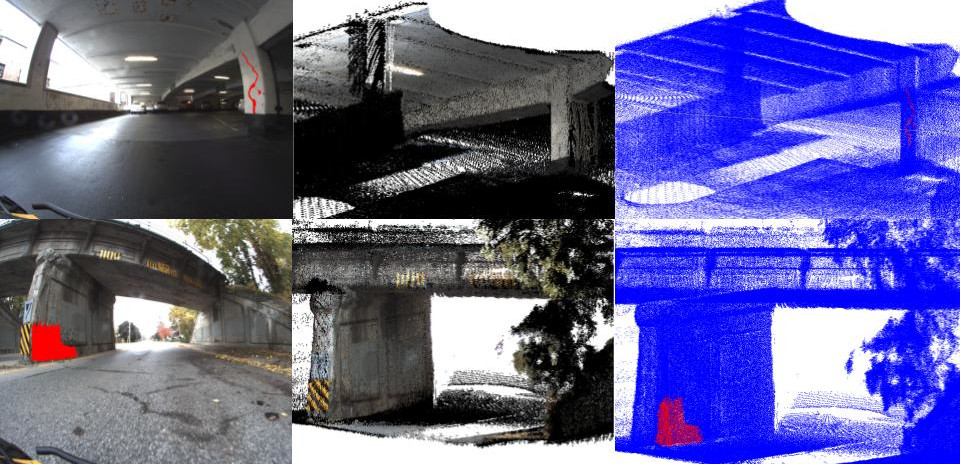

A set of software tools for performing automated visual inspection of infrastructure.

Paper coming soon...

For more information about the underlying algorithms and implementation, refer to [My Thesis](https://uwspace.uwaterloo.ca/items/49aece83-15ec-44fd-9a9b-f68c932d4de5)

## Install Instructions

We recommend installing using catkin to easily locate other dependent packages


### Create catkin workspace and add clone beam_inspection:

```
cd ~/
mkdir -p catkin_ws_inspection/src
cd catkin_ws_inspection
catkin build
cd src
git clone git@github.com:nickcharron/beam_inspection.git
```

### Get dependencies

```
cd ~/catkin_ws_inspection/src
git clone --depth 1 --recursive --shallow-submodules git@github.com:BEAMRobotics/beam_slam.git 
git clone --depth 1 git@github.com:BEAMRobotics/libbeam.git
git clone --depth 1 git@github.com:nickcharron/3d_map_builder.git
git clone --depth 1 git@github.com:nickcharron/calibration_publisher.git
git clone --depth 1 git@github.com:ros-drivers/velodyne.git

# fix fuse
cd beam_slam/dependencies/fuse; git apply ../../FuseOpenMP.patch;
```

### Build in release mode

```
cd ~/catkin_ws_inspection
catkin build -j4 -DCMAKE_BUILD_TYPE=Release 
```

### Update ROS Package Path 

Add this to your ~/.bashrc:

```
ROS_PACKAGE_PATH=/home/{USERNAME}/catkin_ws_inspection/src:/opt/ros/{ROS_DISTRO}/share:/opt/ros/{ROS_DISTRO}/share
```

Making sure to replace USERNAME and ROS_DISTRO, then source:

```
source ~/.bashrc
```

## Run Instructions

The inspection module contains the main code needed to perform an inspections given a ROS bag and SLAM results. There are different modules that need to be called in sequence with the correct input data. There are also metrics and visualizations that can be run, each with their own binaries. To help run all these sequences in order with correct inputs and outputs, we've created pipelines which are a set of python functions that run the operations for you, including SLAM using beam_slam. Here we will show you how to run the pipelines. 

For more information on each of the steps, the pipeline will output the binary commands that were run. You can enter these commands yourself, or you can get more information by calling the help flag (-h) when running these binaries.


### Download Example Data

To help learn how to run beam_inspection, we've included run instructions for running on an example dataset. 

Go to the [Kaggle Dataset](https://www.kaggle.com/datasets/jakemclaughlin/beam-visual-lidar-mapping-dataset) and download one or both of the bag files in the example Parking Garage (2021_10_07_11_01_30_KitchenerParkingGarage) or Bridge (2021_10_07_09_38_36_ParkStBridge) datasets.

Move files to /userhome/beam_data/RECORDING_NAME/raw.bag" to be consistent with the pipeline scripts.

If you want to use segment-anything to label images, download a [model checkpoint](https://github.com/facebookresearch/segment-anything#model-checkpoints) and move them to /userhome/beam_data/sam/

### Install python dependencies

We recommend making a virtual environment to run these pipelines

```
python3 -m venv ~/python_env_inspection
source ~/python_env_inspection/bin/activate
```

Install python dependencies:

```
pip3 install rospkg defusedxml pycryptodomex gnupg netifaces numpy matplotlib opencv-python 
```

If using Segment Anything to label images, run:

```
pip3 install segment-anything torch torchvision
```

### Run All Pipeline

This is the main entry point to running inspection. Let's describe the inputs you need to update to run on your own data. We will also show an example that you can run to get up and running. 


**datasets_config.json**:

This is where you put dataset-specific information to any data you want to run the pipeline on. Let's describe each input:
* path: path to the raw.bag
* start_time_s: when should we start processing data in the bag (0 being from the start). This is helpful for cropping off the start of bags when you're booting up or moving into place.
* duration_s: how long to process data for. Helps crop the data down.
* map_builder_config_filename: filename for map builder config in beam_inspection/inputs. This is helpful if you want different datasets to build maps with different configs. Maybe you used different sensors, or want to turn off specific sensors for that recording. 

**run_all_config.json**:

This allows you to control which components of the pipeline you want to run. We recommend doing one at a time when you first start to learn how it works. Also there are a few settings you can change here which we will describe below. The following will describe each of the components of the pipeline and show results when running on the Park Street Bridge Dataset

to generate results, turn on all components (should be the default) and run:

```
cd ~/catkin_ws_inspection/src/beam_inspection
python3 pipelines/run_all.py -d 1 # run on the 2nd dataset in datasets_config.json
```

**1. preprocess_bag**:

Raw data (raw.bag) comes un-timestamped due to the way the hardware triggering is setup on our data. This needs to be re-stamped for the data to be useable, which is done in tools/bag_processing/restamp_raw_bag.py. Also, the pointcloud data from the default driver run on the velodyne VLP16 comes without timestamps for each point which does not allow us to de-skew. This component also re-processes the lidar packets to timestamp each point.

Next, we separate the data into more easily processable bags:

    - data.bag: used for SLAM only. We remove all topics other than the SLAM camera, IMU, and horizontal lidar
    - inspection.bag: used for generating the inspection map, extracting images for map coloring and defect quantification. 

The below images shows screenshots of all bags (raw, slam, inspection):

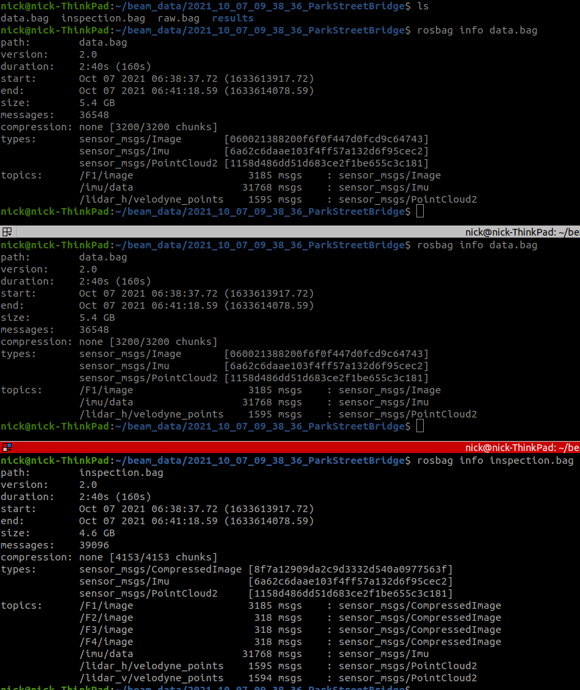

**2. slam**:

This component runs beam_slam if enable flag is set to true. It runs a ROS session automatically, and slows down the bag playback speed with the rosbag_play_rate param. You can also specify the config yaml files which are in beam_slam/beam_slam_launch/config. The default is lio.yaml (lidar-inertial odometry) and global_mapper.yaml. For more information on beam_slam, please read those docs. The global mapper is needed to save all the SLAM data for processing in the map refinement step. You can visualize the SLAM by starting rviz (you can also use our rviz config in beam_slam/beam_slam_launch/rviz)

After running SLAM, you should see a slam folder in your results folder, and inside that you'll see a local_mapper_results.bag and global_mapper_results folder. You can visualize the SLAM map and trajectories by viewing the pcd files in this global_mapper_results folder. Here is an example SLAM map for the bridge dataset:

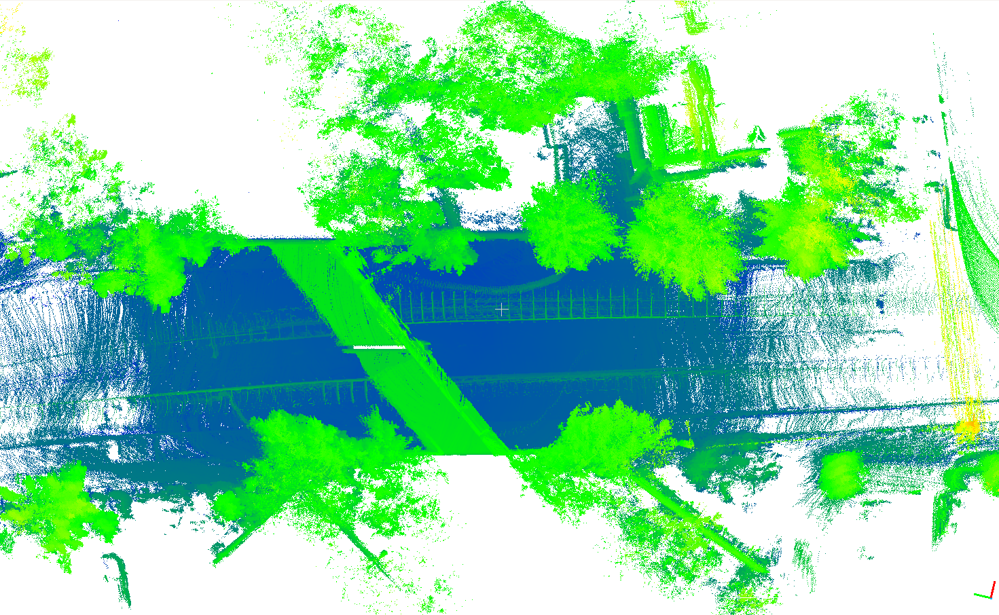

**2. map_refinement**:

This component takes the results from the online SLAM, and refines it using a number of possible refinement techniques. We recommend using run_batch_optimizer only as this has proven to show the best results. If all map refinement options are set to true, it will run them all in order, so results from submap refinement will then be used for submap alignment, etc. Configs for all these steps can be updated from beam_slam/beam_slam_launch/config/global_map/global_map_refinement.json

    - run_submap_refinement: this runs scan registration on all scans within the same submap
    - run_submap_alignment: re-aligns all submaps to each other by running scan registration on the combined pointcloud from all scans in the submap
    - run_posegraph_optimization: runs scan registration between all submap combined clouds, including loop closures between submaps
    - run_batch_optimizer: re-runs essentially the same thing as lio (scan to map registration) but uses large number of scans in the slam map. It then runs loop closure where each scan can be registered against N previous loop closure scans.

Here are example results from the map refinement using the run_batch_optimizer only. The green is the corrected trajectory, the red is the original trajectory. The colors are the loop closure measurements. 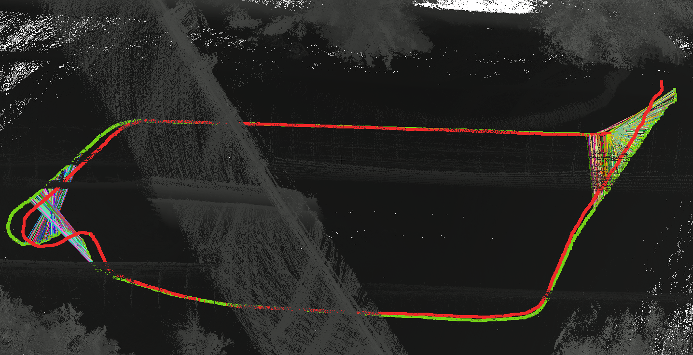

**3. run_map_builder**:

This component runs the map builder to generate a 3D pointcloud map to be used for inspection. For more information, see the [3d_map_builder github repo](https://github.com/nickcharron/3d_map_builder). The map builder will use the config from datasets_config.json. 

NOTE: use_refined_results_for_map set to true will mean the map builder uses the trajectory from the map_refinement, otherwise it uses the SLAM trajectory.

Here is an example map built from the example bridge dataset: 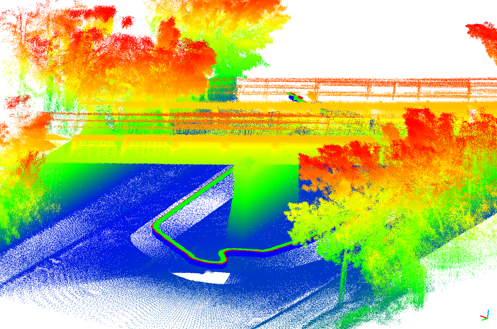

**4. run_image_extractor**:

This component extracts images from the inpection.bag for use in defect detection and map labeling. Config comes from beam_inspection/pipelines/inputs/image_extractor_config.json

This image shows what you should expect to see from this step. Each camera will output its own folder with all images as well as a json file showing all cameras. In each camera folder, there will be a json list of images, and a folder for each image container.

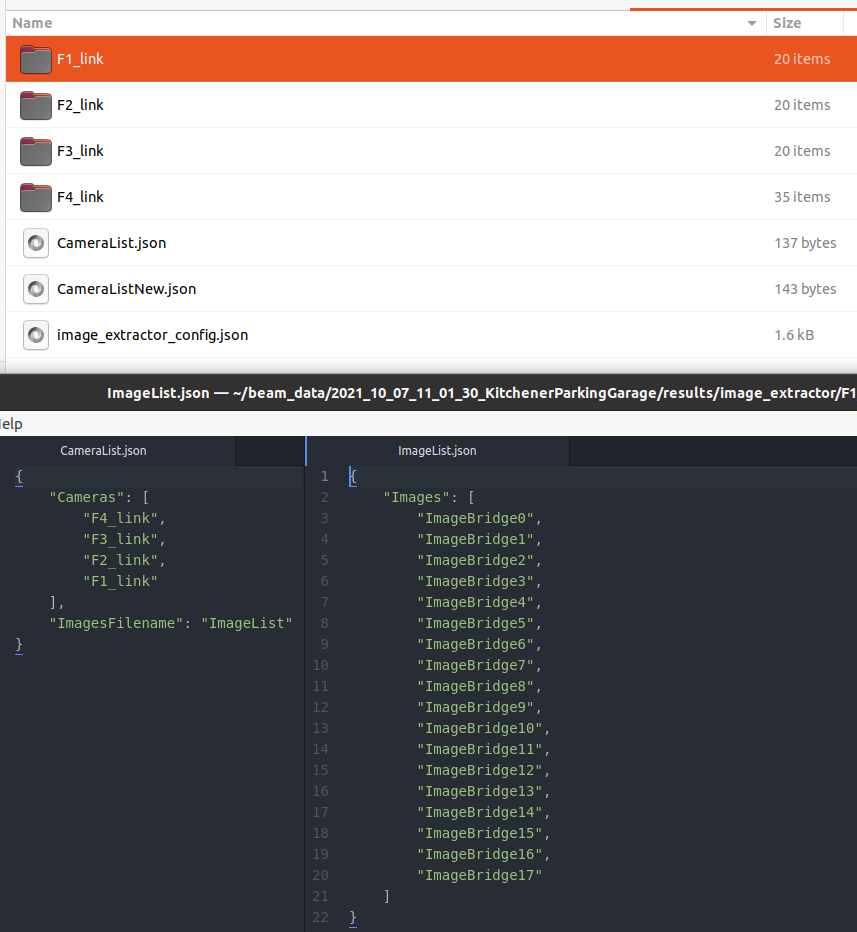

**5. run_image_selection**:

This tool allows you to visualize all images from the image extractor, and set which ones you want to use. Select y or n on each image. This process will output an updated json list of images to use which is shown by the selected_images.json in the above image.


**6. run_sam_labeling**:

This component allows you to create image masks for each of the selected images using segment-anything. A tool will iterate through all images and ask you to select defect locations on the image, then it'll run segmentation and allow you to validate/edit results. 

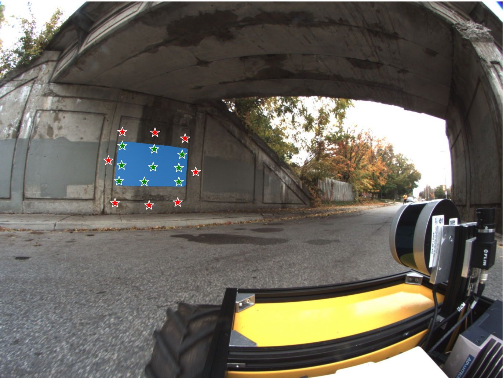

You should expect to see the following images in the image containers which have the stored masks. Note that you can also create these masks any way you want if you have other labeling methods.

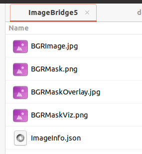

**7. map_labeler**:

This component does two things. First, it colors the map with the RGB images selected above. It then takes all image masks labeled above and projects those to the pointcloud. It does this for each image, saving a cropped map containing only the points that were colored, and also provides a combined map. See the image below for example results on the example bridge dataset.

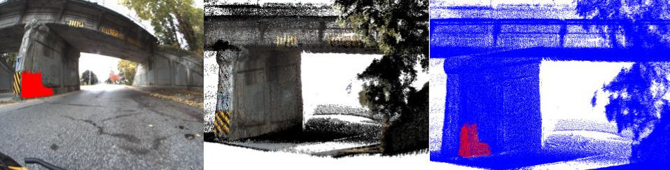
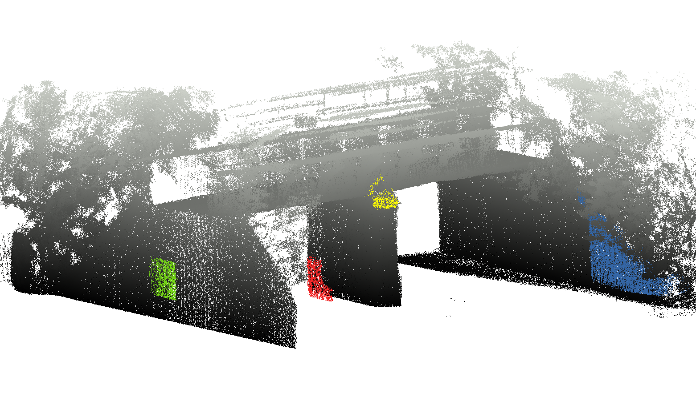


**8.run_quantify_defects**: 

This final component then takes the final labeled map, segments each defect and quantifies its dimensions. Results are then saved for in the map labeler folder, under defect quantification. We store each defect as separate pcd files, and a defects_summary json file. 

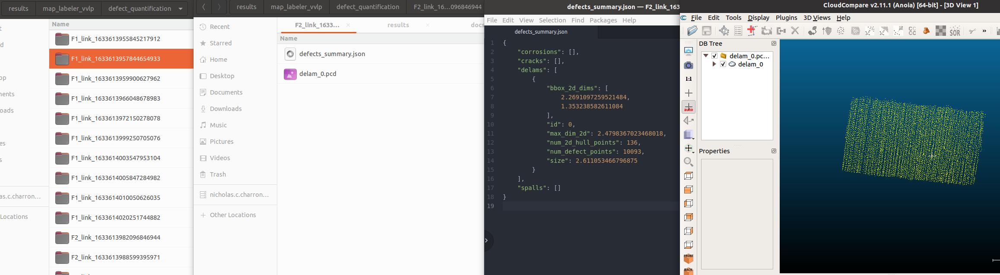
